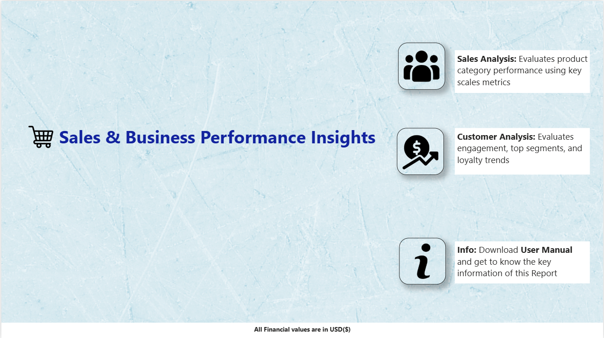
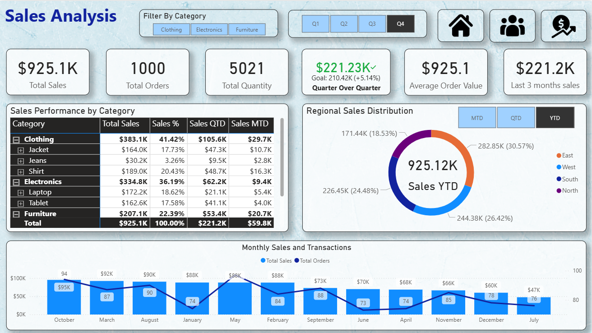
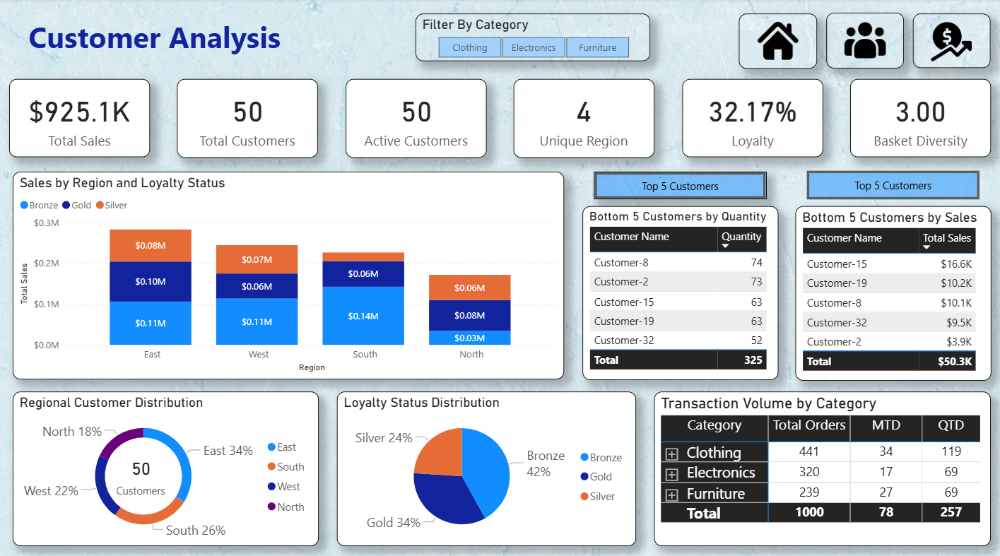
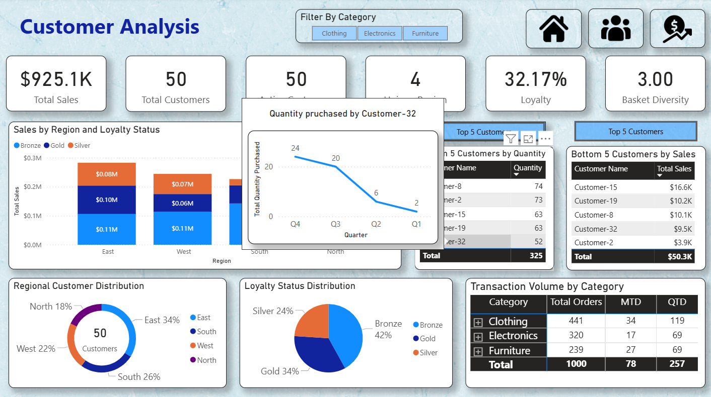
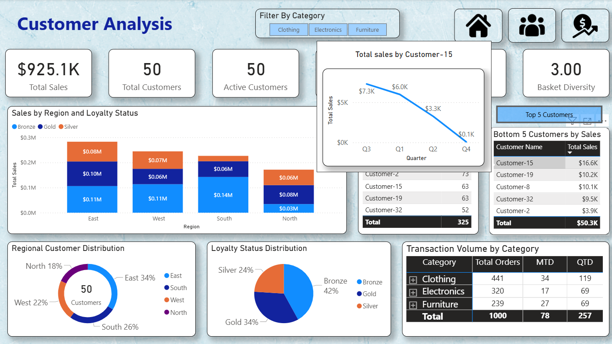
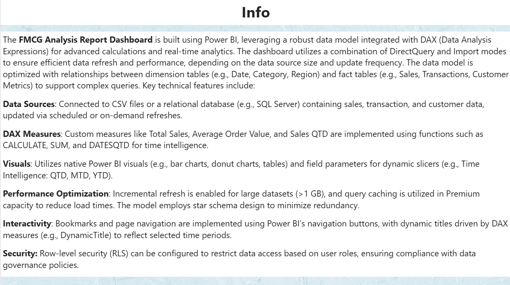

# FMCG Sales and Customer Analytics

## Overview

Compare category performance, sales periods, regional contribution and customer engagement.

**Intended audience:** Sales leaders, category managers and customer-analysis teams.

**Scope:** Sales and customer analysis; category → subcategory → product drill-down; period-selection reporting; customer quantity and sales ranking.

---

## Project Functionality

This Power BI dashboard provides interactive analysis of:

- Sales performance across categories, products, periods and regions.
- Customer behavior, loyalty and regional distribution.
- Top and bottom customer analysis by quantity purchased and sales value.
- MTD, QTD and YTD time-based performance analysis.
- Rolling 3-month sales analysis and YoY comparison.
- Quarter-wise customer trends through custom tooltip pages.
- Interactive filtering using category, region, loyalty and time-period selections.
- Bookmark-based switching between Top 5 and Bottom 5 customer views.
- Region-based and user-email-driven Row-Level Security.

---

## Dashboard Snapshots

### Home Page

### Sales Analysis

### Customer Analysis

### Customer Analysis – Quantity Tooltip

### Customer Analysis – Sales Tooltip

### Info Page

---

## Dashboard Pages

### Home

Navigation hub for Sales Analysis, Customer Analysis and the Info page.

### Info

Provides information about the report, data model, calculations, RLS, navigation and implementation approach.

### Sales Analysis

The Sales Analysis page focuses on:

- Total Sales
- Total Orders
- Total Quantity Purchased
- Average Order Value
- Last 3 Months Sales
- Category → Subcategory → Product analysis
- MTD and QTD sales
- Regional sales contribution
- Monthly sales and order trends
- Period-based sales analysis

### Customer Analysis

The Customer Analysis page focuses on:

- Total Customers
- Active Customers
- Customer loyalty
- Basket Diversity
- Customer quantity and sales rankings
- Regional customer distribution
- Loyalty-status distribution
- Sales by region and loyalty status
- Top and Bottom customer analysis

### Qty Tooltip

Displays quarter-wise customer quantity purchased trends.

### Sales Tooltip

Displays quarter-wise customer sales trends.

---

## Power BI Techniques Implemented

| Technique | Implementation |
|---|---|
| **DAX Measures** | Dynamic KPIs and business calculations |
| **Time Intelligence** | MTD, QTD, YTD, YoY and rolling-period analysis |
| **Disconnected Slicer Table** | Unified period selection using `SWITCH` |
| **Conditional Formatting** | Growth indicators and table-based visual cues |
| **Slicers & Cross-Filtering** | Category, region, loyalty and period filtering |
| **Bookmarks** | Top 5 / Bottom 5 customer view toggling |
| **Tooltip Reports** | Quarter-wise customer quantity and sales trends |
| **Responsive Layout** | Report layout optimized for interactive viewing |
| **Row-Level Security** | Static region-based and dynamic user-based access |

---

## DAX Calculations and Time Intelligence

The dashboard uses DAX for KPI calculations, customer analysis, sales analysis and time-based comparisons.

Time-intelligence functionality includes:

- `DATESMTD` — Month-to-Date analysis.
- `DATESQTD` — Quarter-to-Date analysis.
- `DATESYTD` — Year-to-Date analysis.
- `SAMEPERIODLASTYEAR` — Year-over-Year comparison.
- `DATESINPERIOD` — Rolling-period analysis such as Last 3 Months Sales.
- `SWITCH` — Dynamic period selection through the disconnected period slicer.

Key business measures include:

- `Total Sales`
- `Total Orders`
- `Total Quantity Purchased`
- `Total Customers`
- `Active Customers`
- `Average Order Value`
- `Basket Diversity`
- `Loyalty`
- `Period Sales`
- `Sales MTD`
- `Sales QTD`
- `Orders MTD`
- `Orders QTD`
- `Previous QTD`
- `Last 3 months sales`
- `Sales %`
- `Quantity`
- `Unique Region`

---

## Interactive Analysis

### Period Selection

A disconnected period-selection table is used to allow users to switch between time-based views such as:

- MTD
- QTD
- YTD
- Last 3 Months

The selection dynamically changes the displayed calculations using DAX.

### Top and Bottom Customer Analysis

Bookmarks provide a toggle between:

- Top 5 Customers by Quantity Purchased
- Top 5 Customers by Sales Value
- Bottom 5 Customers by Quantity Purchased
- Bottom 5 Customers by Sales Value

This allows users to switch between customer-performance views without adding separate report pages.

### Tooltip Analysis

Custom tooltip pages provide additional customer context while hovering over relevant visuals.

- **Quantity Tooltip:** Quarter-wise quantity purchased.
- **Sales Tooltip:** Quarter-wise sales performance.

---

## Data and Power Query

Data is sourced from Excel workbooks containing structured business data for sales, products, customers, dates and geography.

**Power Query (M Language)** is used for:

- Data transformation and cleaning.
- Date-table creation.
- Preparing source data for the Power BI semantic model.

The documented source relationships include:

- `Sales[ProductID]` → `Products[ProductID]`
- `Sales[CustomerID]` → `Customers[CustomerID]`
- `Sales[Date]` → `Date[Date]`
- `Sales[RegionID]` → `Geography[RegionID]`

---

## Row-Level Security (Static & Dynamic)

### Static RLS

Region-based access restriction so users only see data belonging to their assigned region.

### Dynamic RLS

Dynamic filtering is implemented using `USERPRINCIPALNAME()`, enabling email-driven access filtering.

This supports role-appropriate access across regions.

---

## Tools Used

- **Excel** — Primary data source and initial exploration.
- **Power BI Desktop** — Data modeling, DAX, visualization and report design.
- **DAX (Data Analysis Expressions)** — Core calculations and time intelligence.
- **Power Query (M Language)** — Data transformation, cleaning and date-table creation.

---

## Business Analysis Covered

| Area | Analysis |
|---|---|
| **Sales** | Regional performance, category contribution and product performance |
| **Customer** | Loyalty, customer engagement and customer performance |
| **Product** | Category, subcategory and product-level analysis |
| **Time Analysis** | MTD/QTD/YTD, rolling 3-month trends and YoY comparison |

---

## Dashboard Navigation

The report uses:

- **Slicers** for interactive filtering.
- **Bookmarks** for Top 5 / Bottom 5 customer analysis.
- **Tooltip pages** for contextual quarter-wise analysis.
- **Drill-down** from category to subcategory and product.
- **Reset/filter interactions** to support report exploration.

---

## Project Outcome

The dashboard brings together sales and customer analytics into an interactive Power BI solution, enabling business users to:

- Monitor sales and order performance.
- Analyze category and product contribution.
- Track customer engagement and loyalty.
- Identify high- and low-performing customers.
- Compare performance across periods and regions.
- Explore customer trends through interactive tooltips.
- Apply secure, region-based access through RLS.

